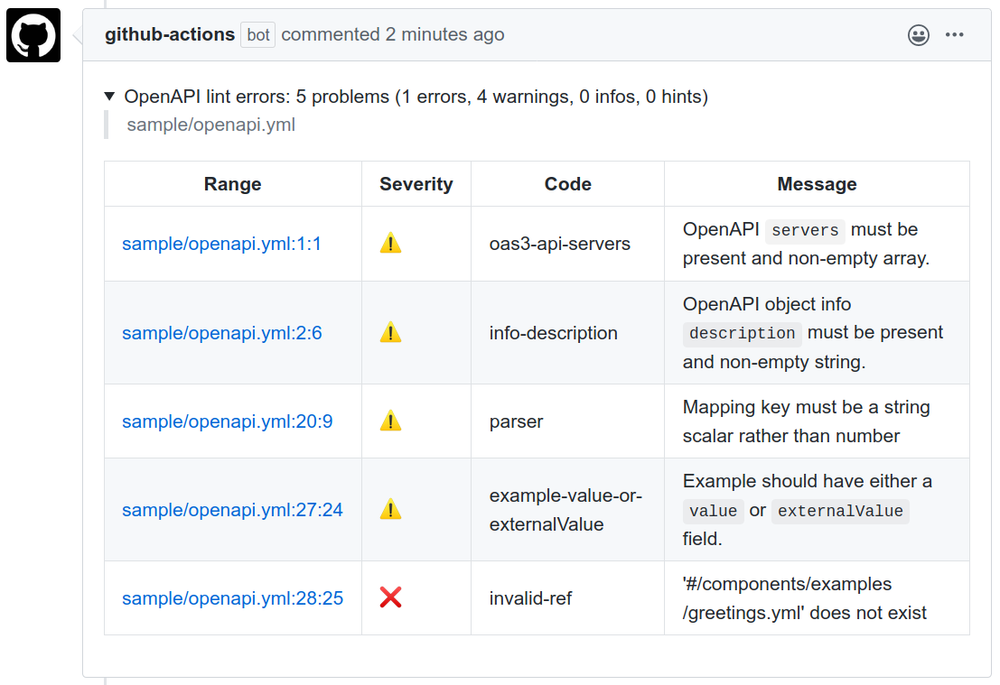

<p align="center">
  <a href="https://github.com/l-lin/spectral-comment-action/actions"></a>
</p>

# Spectral comment action

> Comments pull requests with [Spectral linter](https://github.com/stoplightio/spectral) linter
> outputs using Github action



Check [PR showcase](https://github.com/l-lin/spectral-comment-action/pull/3#issuecomment-600786379).

## Usage

Add or edit an existing workflow:

```yaml
name: "test-action"
on:
  # only works on pull requests
  pull_request:

jobs:
  test:
    name: Lint OpenAPI
    runs-on: ubuntu-latest
    steps:
    - uses: actions/checkout@v1
    - uses: l-lin/spectral-comment-action@0.1.0
      with:
        github-token: ${{ secrets.GITHUB_TOKEN }}
        file-glob: sample/*.yml
```

## License

[MIT](./LICENSE)

